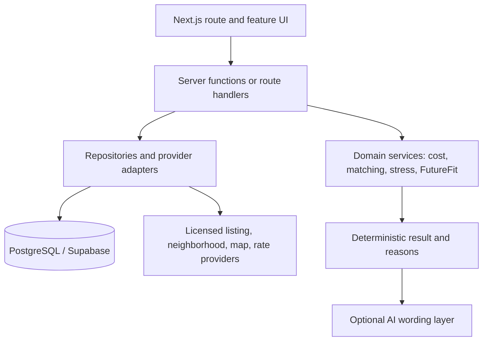

# Architecture

## Current implementation

This is a Next.js App Router frontend prototype. It has public listing (`/`) and property detail (`/property/[id]`) routes. The application uses sample listings, neighborhood scores, ownership costs, and investment assumptions. Favorites, filtering, and calculator inputs live only in browser memory.

```text
app/                              route entries, root layout, global CSS
features/
  listings/                       discovery UI, filters, favorites, map/list toggle
  properties/                     property model, sample repository, map UI
  property-details/               property detail experience
  investment-analysis/            deterministic calculator and presentation
docs/                             product and engineering reference
```

Route files remain server-first and thin. Interactive components explicitly opt into client rendering. Cross-feature imports use `@/`; code stays inside the feature that owns the behavior until a real second consumer emerges.

## Target architecture



Domain services must be pure TypeScript where possible. They accept normalized inputs and return typed results, including reasons, warnings, and unavailable-data states. UI components render those results; they do not calculate critical finance or score values. External provider schemas and credentials remain on the server.

## Planned boundaries

| Boundary | Owns | Must not own |
| --- | --- | --- |
| `properties` | normalized property records and provider contracts | user preferences or match scoring |
| `financials` | mortgage, ownership cost, investment, stress calculations | JSX or provider calls |
| `budget-rules` | profile and rule validation | property persistence |
| `property-matching` | eligibility, score, explanations | database-specific code |
| `neighborhoods` | normalized source data and transparent score breakdown | raw UI provider responses |
| `accounts` | authenticated user-owned data | public listing data |

## Data and integration rules

- Normalize every external response before it reaches a feature UI.
- Model unknown values as unavailable, never as a misleading zero.
- Keep a mock provider for local development and deterministic tests.
- The current market-trend adapter reads Zillow&apos;s city-level Home Value Index server-side and caches it for one day. It is a local-market index, never an address-level appraisal.
- Store privileged credentials only in server-side environment variables.
- Persist user-owned records behind row-level authorization before relying on them for product workflows.
- AI may translate a calculated result into plain language. It cannot create property facts, calculate finance, or override hard rules.

## Current gaps

No database, authentication, provider adapter, persisted favorites, user preference profile, comparison workflow, automated test suite, analytics, route loading/error states, or production data source exists yet. These gaps determine the order in [roadmap.md](./roadmap.md).
